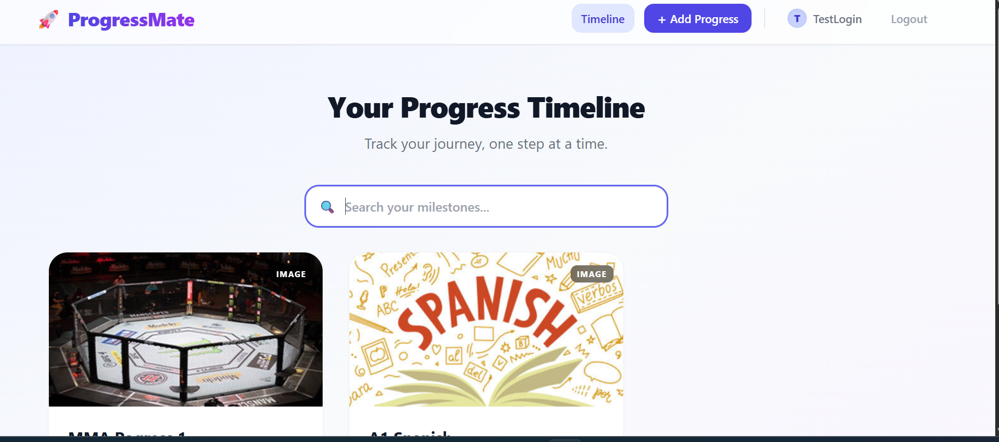
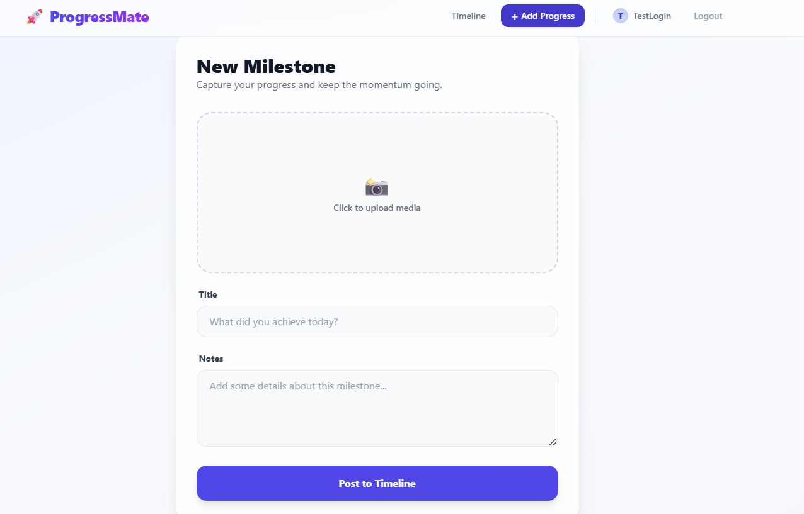
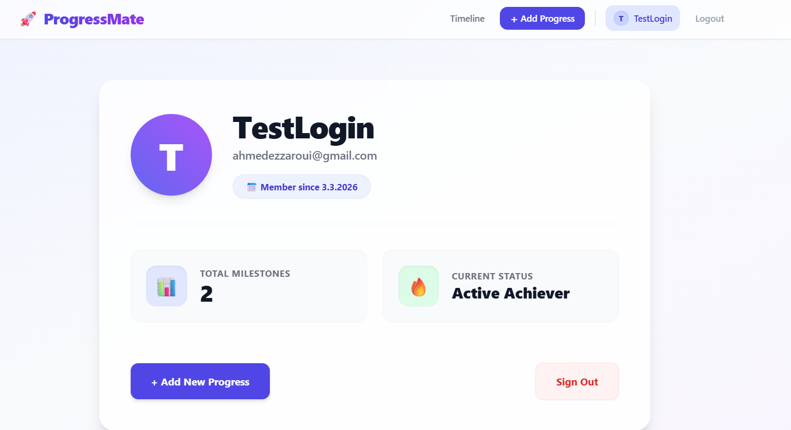

# Individual Project: ProgressMate 🚀

## Description

ProgressMate is a modern web application that allows users to track their progress in a chosen skill or project (e.g., gym training, or learning a new language). The app acts as a visual timeline where users can log stages of their development using images and text.

## Live Demo & Links

- **Live Application (Front-end):** [https://hybrid-progressmate-ahmed.netlify.app](https://hybrid-progressmate-ahmed.netlify.app)
- **Back-end APIs:**
  - Media API: `https://media2.edu.metropolia.fi/media-api/api/v1`
  - Auth API: `https://media2.edu.metropolia.fi/auth-api/api/v1`
  - Upload API: `https://media2.edu.metropolia.fi/upload-api/api/v1`
- **API Documentation & Repositories:** - [Auth Server Repository](https://github.com/AhmedEz9/progressmate-auth)
  - [Media API Repository](https://github.com/AhmedEz9/progressmate-media)
  - [Upload Server Repository](https://github.com/AhmedEz9/progressmate-upload)

## Test User Credentials

To test the application features, you can log in with the following test account:

- **Username:** TestLogin
- **Password:** admin1234

## Screenshots

- **Upload View:**
  
- **User Profile:**
  

## Features Implemented

- **User Management (Auth):** Secure login, registration, logout, and protected routes using JWT tokens.
- **Full CRUD functionality:** Users can create, read, update, and delete their own progress logs.
- **Visual Timeline:** Entries are displayed in chronological order on the home feed.
- **Profile Dashboard:** A summary page showing user statistics (total logs) and user details.
- **Real-time Search:** Built-in search functionality to filter posts instantly.
- **Premium UI/UX:** Responsive design, "Glassmorphism" styling, modern Toast notifications, and loading animations.

## Database Description

The application utilizes the provided course REST APIs. The database is a relational database containing:

- **Users Table:** Stores user credentials, emails, and profile data (handled by Auth API).
- **Media/Posts Table:** Stores the uploaded files (images/videos), titles, descriptions, and associates them with the `user_id` who created them (handled by Media and Upload APIs).

## References & Libraries Used

- **Framework:** React + Vite + TypeScript
- **Styling:** Tailwind CSS
- **Icons:** Heroicons (`@heroicons/react`)
- **Routing:** React Router DOM
- **Forms & Validation:** Custom React hooks
- **Deployment:** Netlify (Front-end)
